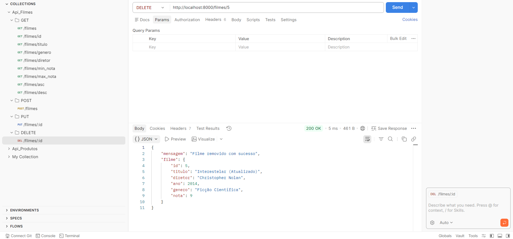

# 🎬 Trabalho API - Catálogo de Filmes

## - Lista de Endpoints da API
### Abaixo estão detalhados todos os caminhos (rotas) disponíveis na aplicação, seus métodos e finalidades.

---
## - GET

### **[GET] / Raiz**
* **Descrição:** Verifica o status de funcionamento da API.
* **URL:** `http://localhost:8000/`
* **Resposta de Sucesso (200 OK):**
```
json

{
  "mensagem": "Manipulação de filmes",
  "status": "sucesso",
  "timestamp": "2026-03-20T21:00:00.000Z"
}

```

### **[GET] / Info**
* **Descrição:** Retorna os metadados do projeto e identificação do autor.
* **URL:** `http://localhost:8000/info`
* **Resposta de Sucesso (200 OK):**

```
json

{
  "nome": "Api de Filmes",
  "versao": "1.0.0",
  "autor": "Erick Shinji"
}

```

### **[GET] / Filmes**
* **Descrição:** Listagem geral com suporte a Busca, Filtros, Ordenação e Paginação.
* **URL:** `http://localhost:8000/filmes?...`
* **Query Params:** pagina, limite, titulo, genero, diretor, min_nota, max_nota, ordem.
* **Resposta de Sucesso (200 OK):**

```
json

{
  "dados": [
    {
      "id": 1,
      "titulo": "O Poderoso Chefão",
      "diretor": "Francis Ford Coppola",
      "ano": 1972,
      "genero": "Crime",
      "nota": 9.2
    }
  ],
  "paginacao": {
    "pagina_atual": 1,
    "total_itens": 10,
    "total_paginas": 1
  }
}

```

### **[GET] / filmes/id/:id**
* **Descrição:** Recupera os dados de um filme específico através do seu ID único.
* **URL:** `http://localhost:8000/filmes/id/1`
* **Resposta de Sucesso (200 OK):**

```
json

{
  "id": 1,
  "titulo": "O Poderoso Chefão",
  "diretor": "Francis Ford Coppola",
  "ano": 1972,
  "genero": "Crime",
  "nota": 9.2
}

```

---

## - POST

### **[POST] / filmes*
* **Descrição:** Realiza o cadastro de um novo filme no catálogo.
* **URL:** `http://localhost:8000/filmes`
* **Corpo da Requisição (Body JSON):**

```
json

{
  "titulo": "Interestelar",
  "diretor": "Christopher Nolan",
  "ano": 2014,
  "genero": "Ficção Científica",
  "nota": 8.7
}

```

* **Resposta de Sucesso (201 Created):**

```
json


{
  "id": 11,
  "titulo": "Interestelar",
  "diretor": "Christopher Nolan",
  "ano": 2014,
  "genero": "Ficção Científica",
  "nota": 8.7
}

```

---

## - Exemplos de Requisição no Postman
### Abaixo estão os modelos de como configurar as chamadas para testar a API.

* ### Exemplo 01: Cadastrar Novo Filme (POST)

* **Método:** `POST`
* **URL:** `http://localhost:8000/filmes`
* **Configuração: Selecionar Body > raw > JSON.** 
* **Body enviado:** 

```
json

{
  "titulo": "Duna: Parte Dois",
  "diretor": "Denis Villeneuve",
  "ano": 2024,
  "genero": "Ficção Científica",
  "nota": 8.6
}

```


* ### Exemplo 02: Buscar com Filtros e Ordenação (GET)

* **Método:** `GET`
* **URL:** `http://localhost:8000/filmes?genero=Crime&min_nota=8.8&ordem=desc`
* **Objetivo:** Listar filmes do gênero "Crime" com nota mínima 8.8, ordenados do ID maior para o menor.
* **Resultado:** 

``` 
json


{
  "dados": [
    {
      "id": 4,
      "titulo": "Pulp Fiction",
      "diretor": " ",
      "ano": 1994,
      "genero": "Crime",
      "nota": 8.9
    },
    {
      "id": 1,
      "titulo": "O Poderoso Chefão",
      "diretor": "Francis Ford Coppola",
      "ano": 1972,
      "genero": "Crime",
      "nota": 9.2
    }
  ],
  "paginacao": {
    "pagina_atual": 1,
    "total_itens": 2,
    "total_paginas": 1
  }
}

```

* ### Exemplo 03: Paginação (GET)

* **Método:** `GET`
* **URL:** `http://localhost:8000/filmes?pagina=1&limite=5`
* **Objetivo:** Retornar apenas os 5 primeiros filmes cadastrados.
* **Resultado:** 

``` 
json

{
  "dados": [
    {
      "id": 1,
      "titulo": "O Poderoso Chefão",
      "diretor": "Francis Ford Coppola",
      "ano": 1972,
      "genero": "Crime",
      "nota": 9.2
    },
    {
      "id": 2,
      "titulo": "Batman: O Cavaleiro das Trevas",
      "diretor": "Christopher Nolan",
      "ano": 2008,
      "genero": "Ação",
      "nota": 9
    },
    {
      "id": 3,
      "titulo": "A Lista de Schindler",
      "diretor": "Steven Spielberg",
      "ano": 1993,
      "genero": "Biografia",
      "nota": 9
    },
    {
      "id": 4,
      "titulo": "Pulp Fiction",
      "diretor": " ",
      "ano": 1994,
      "genero": "Crime",
      "nota": 8.9
    },
    {
      "id": 5,
      "titulo": "O Senhor dos Anéis: O Retorno do Rei",
      "diretor": "Peter Jackson",
      "ano": 2003,
      "genero": "Aventura",
      "nota": 9
    }
  ],
  "paginacao": {
    "pagina_atual": 1,
    "total_itens": 15,
    "total_paginas": 3
  }
}

```

* ### Exemplo 04: Buscar Filme por ID (GET)

* **Método:** `GET`
* **URL:** `http://localhost:8000/filmes/id/2`
* **Objetivo:** Retornar os detalhes específicos do filme que possui o ID 2.
* **Resultado:** 

``` 
json

{
  "id": 2,
  "titulo": "Batman: O Cavaleiro das Trevas",
  "diretor": "Christopher Nolan",
  "ano": 2008,
  "genero": "Ação",
  "nota": 9
}

```

* ### Exemplo 05: Teste de Erro de Validação (POST)

* **Método:** `POST`
* **URL:** `http://localhost:8000/filmes`
* **Body enviado (Erro proposital - Nota como texto):** 

``` 
json    

{
  "titulo": "Filme Teste",
  "diretor": "Diretor Teste",
  "ano": 2024,
  "genero": "Drama",
  "nota": "dez" 
}

```

* **Resposta Esperada:** `Status 400 Bad Request`

---

## Capturas de tela dos testes

*  ### Print 01: Listagem Inicial (Padrão)

* **Método:** `GET`
* **URL:** `http://localhost:8000/filmes`
* **O que deve aparecer:** A lista com os 10 filmes originais, começando pelo ID 1.
* **Print do Postman:** 


---

*  ### Print 02: Cadastro de Novo Filme (Sucesso)

* **Método:** `POST`
* **URL:** `http://localhost:8000/filmes`
* **Body enviado:** 

``` 
json

{
  "titulo": "Oppenheimer",
  "diretor": "Christopher Nolan",
  "ano": 2023,
  "genero": "Biografia",
  "nota": 8.4
}

```

* **Print do Postman:** 


---

### 📸 **Print 03: Filtro por Gênero**
* **Método:** `GET`
* **URL:** `http://localhost:8000/filmes?genero=Ficção Científica`
* **O que deve aparecer:** Apenas os filmes de Ficção Científica (Matrix, Interestelar, etc).

* **Print do Postman:** 


---

### 📸 **Print 04: Ordenação Decrescente**
* **Método:** `GET`
* **URL:** `http://localhost:8000/filmes?ordem=desc`
* **O que deve aparecer:** A lista começando do maior ID para o menor (ex: ID 11, 10, 9...).

* **Print do Postman:** 


---

### 📸 **Print 05: Erro - Campo Faltando**
* **Método:** `POST`
* **URL:** `http://localhost:8000/filmes`
* **Body (JSON):** Envie apenas o título: `{"titulo": "Filme sem nada"}`.
* **O que deve aparecer:**  A mensagem de erro que colocamos no código.

* **Print do Postman:** 


---

### 📸 **Print 06: Erro - Tipo de Dado Errado**
* **Método:** `POST`
* **URL:** `http://localhost:8000/filmes`
* **Body (JSON):** ```json
{
  "titulo": "Filme Erro",
  "diretor": "Teste",
  "ano": "dois mil e vinte",
  "genero": "Ação",
  "nota": 9.0
}

* **Print do Postman:** 


---

## Explicação de Validações Implementadas
### A segurança e a integridade dos dados são garantidas por um conjunto de validações no endpoint POST /filmes. Abaixo, detalho como cada uma funciona no código:

---

### **1. Validação de Campos Obrigatórios**
* **O que faz:** Verifica se o usuário enviou todas as informações necessárias (`titulo`, `diretor`, `ano`, `genero`, `nota`).
* **Código:**
```javascript
if (!titulo || !diretor || !ano || !genero || !nota) {
    return res.status(400).json({ erro: "Todos os campos são obrigatórios!" });
}
```

---

### **2. Validação de Tipagem Estrita**

* **O que faz:** Garante que os campos numéricos (ano e nota) recebam apenas números e não textos.
* **Código:**

```javascript

if (typeof ano !== 'number' || typeof nota !== 'number') {
    return res.status(400).json({ erro: "Ano e Nota devem ser números!" });
}

```

* **Por que é importante:** Evita erros de cálculo na ordenação e garante que a API siga o contrato de dados definido.

---

### **3. Tratamento Automático de Paginação**

* **O que faz:** Caso o usuário envie valores de página ou limite menores que 1 (ou deixe em branco), a API corrige para o padrão.
* **Código:**

```javascript

const paginaNum = Math.max(1, parseInt(pagina) || 1);
const limiteNum = Math.max(1, parseInt(limite) || 10);

```

* **Por que é importante:** Torna a API mais "inteligente" e evita que o servidor tente processar páginas inexistentes (ex: página -5).

---

### **4. Flexibilidade na Ordenação**

* **O que faz:** O sistema aceita múltiplos termos para definir a ordem dos IDs.
* **Lógica:** Se o usuário digitar desc(decrescente), a API inverte a lista. Caso contrário, ela sempre mantém a ordem asc (crescente).
* **Código:**

```javascript

const paginaNum = Math.max(1, parseInt(pagina) || 1);
const limiteNum = Math.max(1, parseInt(limite) || 10);

```

* **Por que é importante:** Torna a API mais "inteligente" e evita que o servidor tente processar páginas inexistentes (ex: página -5).

## - PUT

### *** [PUT] / filmes/id/:id ***

* **Descrição:** Atualiza completamente os dados de um filme existente a partir do seu ID.
* **URL:** `http://localhost:8000/filmes/id/5`
* **Corpo da Requisição (Body JSON):**

```
json

{
  "titulo": "Interestelar (Atualizado)",
  "diretor": "Christopher Nolan",
  "ano": 2014,
  "genero": "Ficção Científica",
  "nota": 9.0
}
```

* **Resposta de Sucesso (200 OK): ** 

```
json

{
  "id": 5,
  "titulo": "Interestelar (Atualizado)",
  "diretor": "Christopher Nolan",
  "ano": 2014,
  "genero": "Ficção Científica",
  "nota": 9.0
}
```

* **Print do Postman:**


## - DELETE

### *** [DELETE] / filmes/id/:id ***

* **Descrição:** Remove um filme do catálogo com base no seu ID.
* **URL:** `http://localhost:8000/filmes/id/5`
* **CoResposta de Sucesso (200 OK):**

```
json

{
  "mensagem": "Filme removido com sucesso!"
}
```

* **Print no Postman:**



## - Exemplos de Requisição no Postman (PUT e DELETE)

**Exemplo 06: Atualizar Filme (PUT)**

* **Método:** `PUT`
* **URL:** `http://localhost:8000/filmes/id/5`
* **Configuração:** Body > raw > JSON
* **Body enviado:**

```
json

{
  "titulo": "Matrix Reloaded",
  "diretor": "Lana Wachowski, Lilly Wachowski",
  "ano": 2003,
  "genero": "Ficção Científica",
  "nota": 7.2
}
```

* **Resposta de Sucesso (200 OK):**

```
json

{
  "id": 1,
  "titulo": "Interestelar (Atualizado)",
  "diretor": "Christopher Nolan",
  "ano": 2014,
  "genero": "Ficção Científica",
  "nota": 9.0
}
```

**Exemplo 07: Deletar Filme (DELETE)**

* **Método:** `DELETE`
* **URL:** `http://localhost:8000/filmes/id/5`
* **Objetivo:** Remover o filme com ID 1 do sistema.
* **Resultado:**

```
json

{
  "mensagem": "Filme removido com sucesso", 
  filme: filmeRemovido[6]
}
```